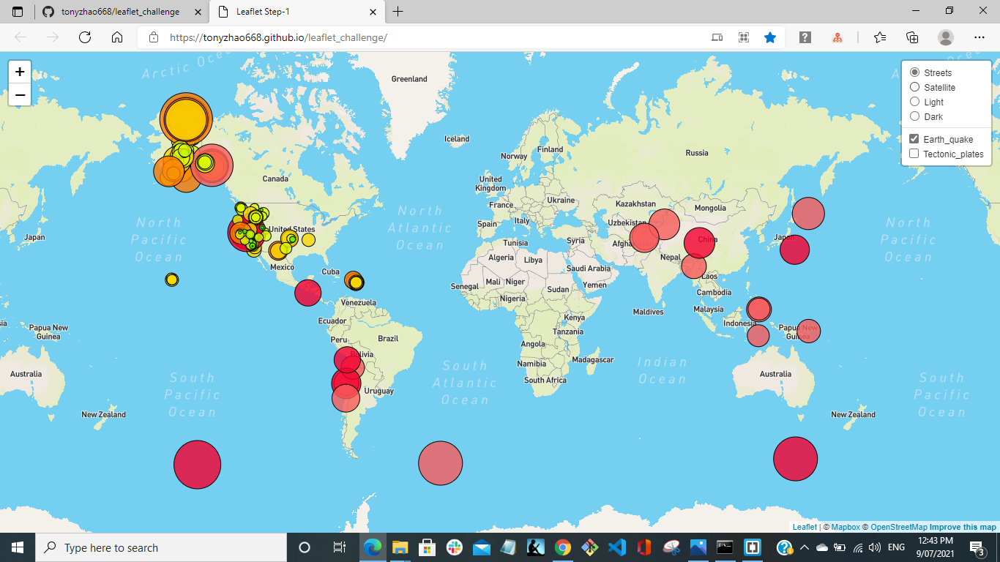
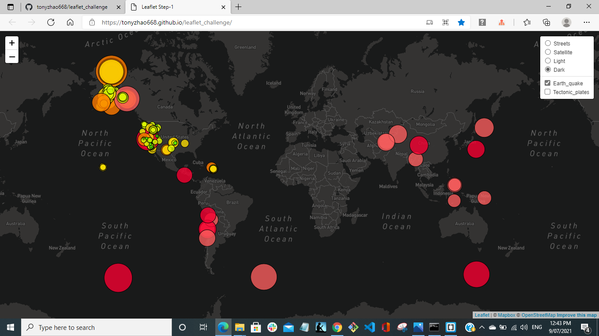
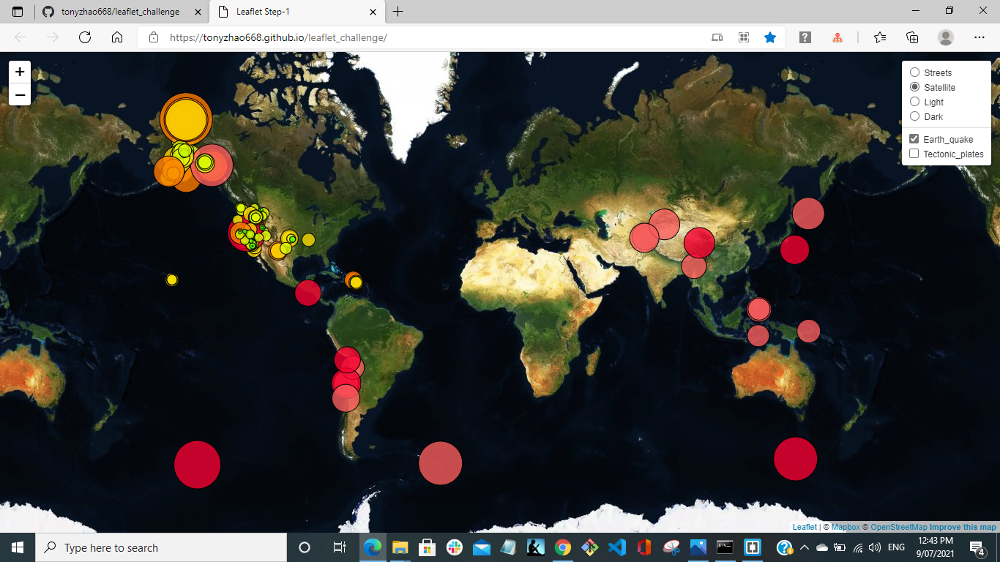

# Leaflet - Visualizing Data with Leaflet

Finished by Tony Zhao 21/04/2021

## Background

The USGS is responsible for providing scientific data about natural hazards, the health of our ecosystems and environment; and the impacts of climate and land-use change. Their scientists develop new methods and tools to supply timely, relevant, and useful information about the Earth and its processes. 

The task is to visualize USGS' data to better educate the public and other government organizations on issues facing our planet.

## The Task Details

### The final website show link:

[World Earthquake](https://tonyzhao668.github.io/leaflet_challenge/)

### Level 1: Basic Visualization

 task is to visualize an earthquake data set.

1. **Get the data set**

   

   The USGS provides earthquake data in a number of different formats, updated every 5 minutes. Visit the [USGS GeoJSON Feed](http://earthquake.usgs.gov/earthquakes/feed/v1.0/geojson.php) page and pick a data set to visualize. I have selected 'All Earthquakes from the Past 7 Days', and get the JSON representation of that data. 
   

2. **Import & Visualize the Data**

   **Dark Style:**
    
    
    **Satellite Style:**
    
    
    
   Create the map using Leaflet that plots all of the earthquakes from the data set based on their longitude and latitude.

   * The data markers should reflect the magnitude of the earthquake in their size and color. Earthquakes with higher magnitudes should appear larger and darker in color.

   * Include popups that provide additional information about the earthquake when a marker is clicked.

   * Create a legend that will provide context for the map data.

- - -

### Level 2: More Data

To plot a second data set on your map to illustrate the relationship between tectonic plates and seismic activity. To pull in a second data set and visualize it along side the original set of data. Data on tectonic plates is found at <https://github.com/fraxen/tectonicplates>.

* Plot a second data set on our map.

* Add a number of base maps to choose from as well as separate out our two different data sets into overlays that can be turned on and off independently.

* Add layer controls to our map.

- - -

